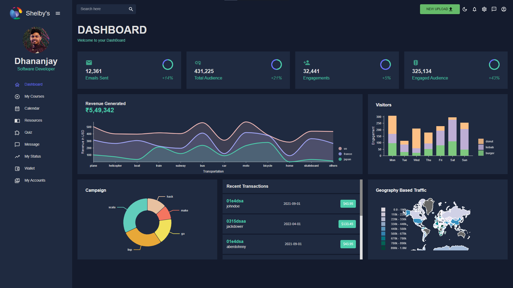
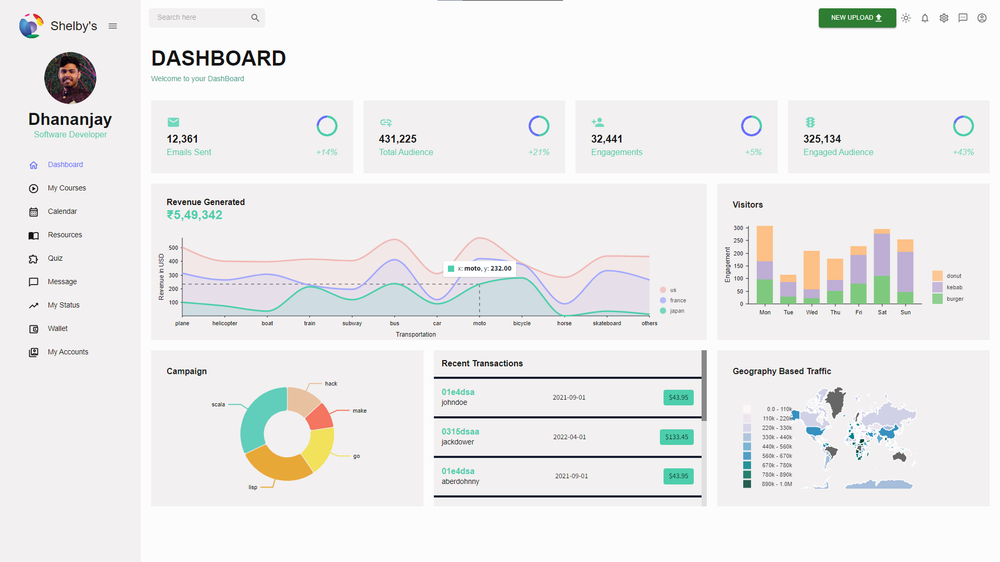

# Dashboard Layout

A basic structure of a Dashboard built with React

## Table of Contents

- [Introduction](#introduction)
- [Features](#features)
- [Installation and Usage](#installation-and-usage)
- [Screenshots](#screenshots)
- [Contributing](#contributing)


## Introduction
It is a simple Dashboard design for front-end. Comes with both 'Light' and 'Dark' mode. The application is built using React, Material UI, with Nivo, which provides a rich set of dataviz components, built on top of D3 and React.

## Features
* Toggle between Light and Dark mode.
* The project shows any sample data in an interactive and creative manner
* Can be used to design any single page web applications

## Installation and Usage

Clone the repository:

```bash
git clone https://github.com/dhananjay07b/Dashboard.git
```

Install the dependencies:

```bash
cd Task-Management
npm install
```

Run the development server:

```bash
npm start
# or
yarn run
# or
pnpm run
```

Open [http://localhost:3000](http://localhost:3000) with your browser to see the result.

Use the interface to manage your tasks. Tasks will be persisted in the browser's local storage.

You can start editing the page by modifying `./src/App.js`. The page auto-updates as you edit the file.

## Screenshots

### Dark Mode:
<p align="center">
    
</p>

### Light Mode:
<p align="center">
    
</p>

### Toggle Sidebar:
<p align="center">
    
</p>


## Contributing

Contributions are welcome! If you have any ideas, suggestions, or bug reports, please open an issue or submit a pull request.

Feel free to reach out to me for further discussions on emerging technologies or any other topics of interest.

Keep the Code Alive !
